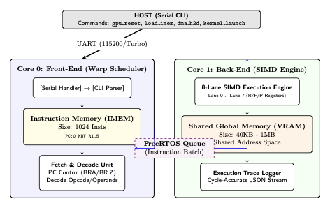
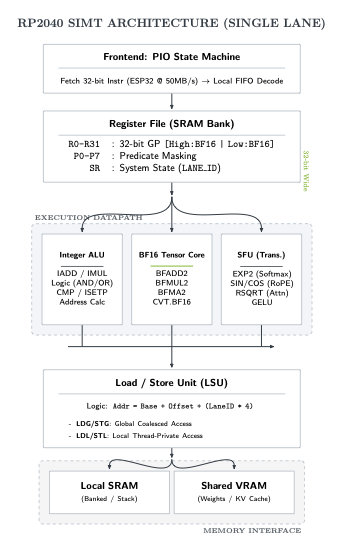
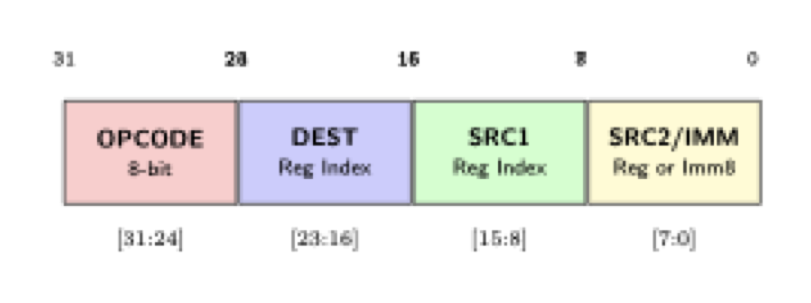

# Micro-CUDA v2.0: SIMT Architecture on ESP32

[](https://opensource.org/licenses/MIT)
[](https://www.espressif.com/en/products/socs/esp32-s3)
[]()

**Micro-CUDA** is a research project establishing a true **SIMT (Single Instruction, Multiple Threads)** architecture on standard dual-core microcontrollers. It transforms the ESP32-S3 into a **Micro-SM (Streaming Multiprocessor)**, enabling CUDA-like parallel programming, BFloat16 tensor operations, and warp scheduling without requiring an actual GPU.

---

## 🏗️ Architecture: The Micro-SM

The system implements a classic **Front-End / Back-End** GPU architecture. The ESP32's dual cores are utilized to decouple instruction scheduling from parallel execution, emulating the internal structure of a discrete GPU Streaming Multiprocessor.

### 1. Internal Micro-Architecture (ESP32-S3)

Host commands drive **Core 0** (Front-End), which fetches instructions and dispatches them via a hardware queue to the **Core 1** (SIMD Engine).



### 2. SIMT Lane Architecture (Execution Core)

Each SIMD lane operates in lockstep, possessing its own register context and execution units.



### Key Components

1.  **Front-End (Core 0 - Warp Scheduler)**:

    - Fetches 32-bit instructions from the instruction buffer.
    - Handles control flow (Branch, Loop, Yield).
    - Dispatches active warps to the execution engine via a hardware queue.

2.  **Back-End (Core 1 - SIMD Engine)**:
    - **8-Lane SIMT Execution**: Executes the same instruction across 8 data lanes in lockstep.
    - **Register File**: Each lane possesses its own localized register bank (R0-R31, F0-F31, P0-P7).
    - **Tensor Core**: Integrated support for **Packed BFloat16** matrix operations (`BFMA`, `CVT`).
    - **SFU**: Special Function Unit for hardware-accelerated `EXP2`, `RSQRT`, and `SIN/COS` (RoPE).

---

## ⚡ Micro-CUDA ISA v2.0 Specification

The ISA is a 32-bit RISC-style instruction set optimized for deep learning and tensor math. It is fully described in the [Research Paper](docs/paper/main.pdf).

### Instruction Format (32-bit)



### Instruction Groups

| Group    | Functionality            | Examples                                                  |
| :------- | :----------------------- | :-------------------------------------------------------- |
| **0x00** | **System Control**       | `EXIT`, `NOP`, `BRA` (Branch), `WAIT` (Sync)              |
| **0x10** | **Integer ALU**          | `IADD`, `ISUB`, `IMUL`, `ISETP` (Set Predicate)           |
| **0x20** | **AI & Tensor**          | `CVT.BF16`, `PACK2`, `BFMA2` (BFloat16 FMA)               |
| **0x30** | **Floating Point**       | `FADD`, `FMUL`, `FMA` (Fused Multiply-Add)                |
| **0x40** | **SFU (Transcendental)** | `RSQRT`, `SIN`, `COS`, `EXP2`, `LOG2`                     |
| **0x50** | **Memory (LSU)**         | `LDG` (Global Load), `STG` (Global Store), `LDS` (Shared) |

---

## 🚀 Getting Started

Micro-CUDA provides a Python-first development experience. You don't need to write C++ firmware; just flash the provided firmware once, and then write kernels in Python.

### 1. Flash Firmware (One-time)

```bash
# Upload the pre-compiled VM to your ESP32
./upload_esp32.sh
```

### 2. Write a Kernel (Python)

Create `hello_cuda.py`:

```python
from esp32_tools import quick_run, Instruction

# Simple Kernel: R2 = R0 * R1
program = [
    Instruction.mov(0, 10),       # R0 = 10
    Instruction.mov(1, 5),        # R1 = 5
    Instruction.imul(2, 0, 1),    # R2 = R0 * R1 = 50
    Instruction.exit_inst()
]

# Run on device (Change PORT to your actual USB port)
quick_run(
    port="/dev/cu.usbserial-0001",
    program=program,
    expected={'R2': 50}
)
```

### 3. Run It

```bash
python hello_cuda.py
```

---

## 📚 Documentation

Detailed documentation and research papers are available in the `docs/` directory:

- 📄 **[Research Paper (PDF)](docs/paper/main.pdf)**: Complete academic paper detailing the architecture, ISA, and performance benchmarks.
- 📖 **[ISA Reference](docs/paper/sections/03_isa.tex)**: The LaTeX source for the ISA specification.
- 🛠️ **[Tools Guide](docs/README_V2.md)**: Detailed usage guide for the Python SDK, Profiler, and Tracer.
- 🧠 **[SIMD Lane Guide](docs/SIMD_LANE_GUIDE.md)**: Deep dive into the 8-lane SIMD execution model.

---

## 📂 Project Structure

- `esp32_tools/`: Python SDK for host-side control.
- `arduino_tools/`: C++ Firmware source code (VM implementation).
- `docs/`: Documentation, specifications, and the LaTeX paper.
- `examples_usage/`: Sample kernels (Matrix Multiplication, Transformer Attention, etc.).
