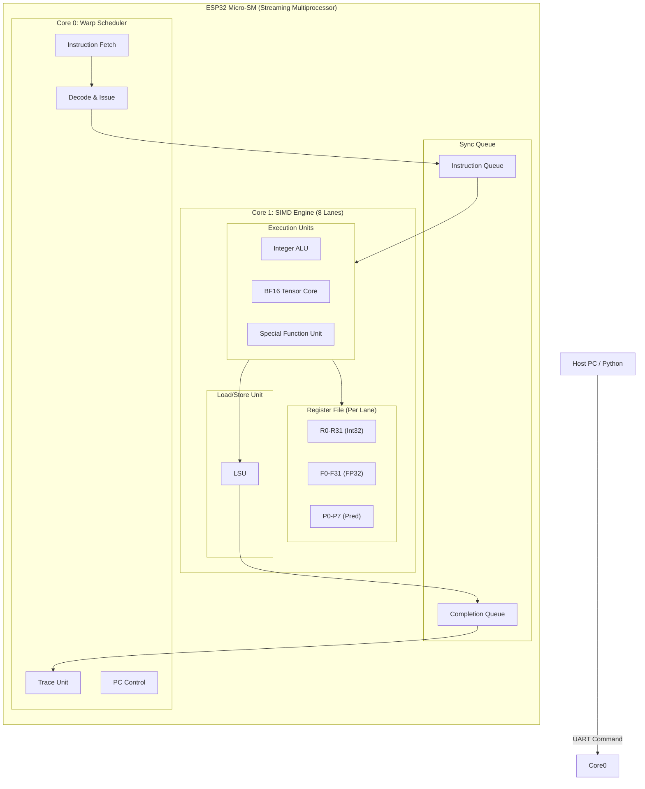

# Micro-CUDA v2.0: SIMT Architecture on ESP32

[](https://opensource.org/licenses/MIT)
[](https://www.espressif.com/en/products/socs/esp32-s3)
[]()

**Micro-CUDA** is a research project establishing a true **SIMT (Single Instruction, Multiple Threads)** architecture on standard dual-core microcontrollers (ESP32-S3). It enables CUDA-like parallel programming, BFloat16 tensor operations, and warp scheduling without requiring an actual GPU.

---

## 🏗️ Architecture

The system implements a classic **Front-End / Back-End** GPU architecture using the ESP32's dual cores:



### Key Components

1.  **Grid Master (Host)**: Python-based host that manages kernels, memory (`malloc`, `memcpy`), and launches grids.
2.  **Warp Scheduler (Core 0)**: Fetches instructions, handles control flow (branching/looping), and dispatches warps.
3.  **SIMD Engine (Core 1)**: An 8-lane lockstep execution engine. Each lane has its own register file (R32/F32/P8) but shares the instruction stream.

---

## ⚡ Micro-CUDA ISA v2.0 specification

The ISA is a 32-bit RISC-style instruction set optimized for deep learning.

### Instruction Format (32-bit)

| Bit Range | Field        | Description                                |
| :-------- | :----------- | :----------------------------------------- |
| `[31:26]` | **OPCODE**   | 6-bit Operation Code (64 instructions max) |
| `[25:21]` | **DEST**     | Destination Register (Rd)                  |
| `[20:16]` | **SRC1**     | Source Register 1 (Ra)                     |
| `[15:11]` | **SRC2**     | Source Register 2 (Rb) or High bits of Imm |
| `[10:0]`  | **IMM/Func** | Immediate value or Extended Function bits  |

### Instruction Groups

1.  **System Control (0x00-0x0F)**: `EXIT`, `NOP`, `BRA` (Branch), `WAIT` (Sync)
2.  **Integer Arithmetic (0x10-0x1F)**: `IADD`, `ISUB`, `IMUL`, `ISETP` (Set Predicate)
3.  **AI & Data Conversion (0x20-0x2F)**: `CVT.BF16`, `PACK2`, `BFADD2`, `BFMUL2` (Packed BFloat16)
4.  **Floating Point (0x30-0x3F)**: `FADD`, `FMUL`, `FMA` (Fused Multiply-Add)
5.  **Special Functions (SFU) (0x40-0x4F)**: `RSQRT` (Fast Inverse Sqrt), `SIN`, `COS`, `EXP2`, `LOG2`
6.  **Memory Operations (0x50-0x5F)**: `LDG` (Global Load), `STG` (Global Store), `LDS` (Shared Load)

---

## 🚀 Getting Started

Micro-CUDA provides a Python-first development experience. You don't need to write C++ firmware; just flash the provided firmware once, and then write kernels in Python.

### 1. Flash Firmware (One-time)

```bash
# Upload the pre-compiled VM to your ESP32
./upload_esp32.sh
```

### 2. Write a Kernel (Python)

Create `hello_cuda.py`:

```python
from esp32_tools import quick_run, Instruction

# Simple Kernel: R2 = R0 * R1
program = [
    Instruction.mov(0, 10),       # R0 = 10
    Instruction.mov(1, 5),        # R1 = 5
    Instruction.imul(2, 0, 1),    # R2 = R0 * R1 = 50
    Instruction.exit_inst()
]

# Run on device (Change PORT to your actual USB port)
quick_run(
    port="/dev/cu.usbserial-0001",
    program=program,
    expected={'R2': 50}
)
```

### 3. Run It

```bash
python hello_cuda.py
```

---

## 📚 Documentation

Detailed documentation and research papers are available in the `docs/` directory:

- 📄 **[Research Paper (PDF)](docs/paper/main.pdf)**: complete academic paper detailing the architecture, ISA, and performance benchmarks.
- 📖 **[ISA Reference](docs/paper/sections/03_isa.tex)**: The LaTeX source for the ISA specification.
- 🛠️ **[Tools Guide](docs/README_V2.md)**: Detailed usage guide for the Python SDK, Profiler, and Tracer.
- 🧠 **[SIMD Lane Guide](docs/SIMD_LANE_GUIDE.md)**: Deep dive into the 8-lane SIMD execution model.

---

## 📂 Project Structure

- `esp32_tools/`: Python SDK for host-side control.
- `arduino_tools/`: C++ Firmware source code (VM implementation).
- `docs/`: Documentation, specifications, and the LaTeX paper.
- `examples_usage/`: Sample kernels (Matrix Multiplication, Transformer Attention, etc.).
