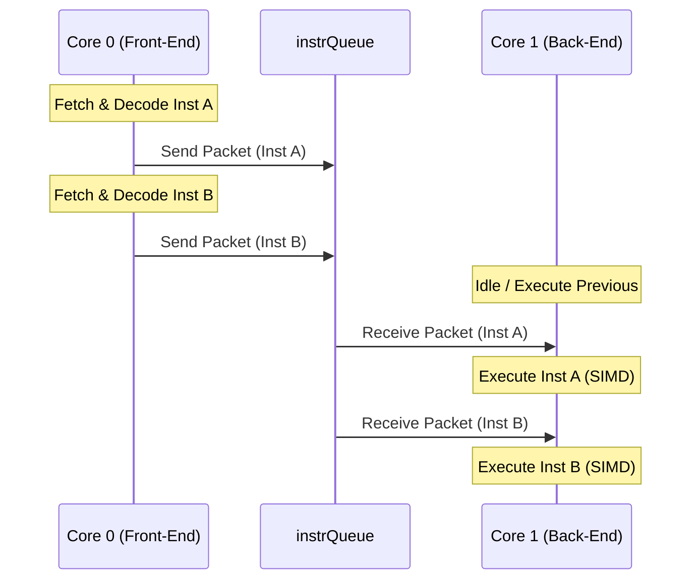
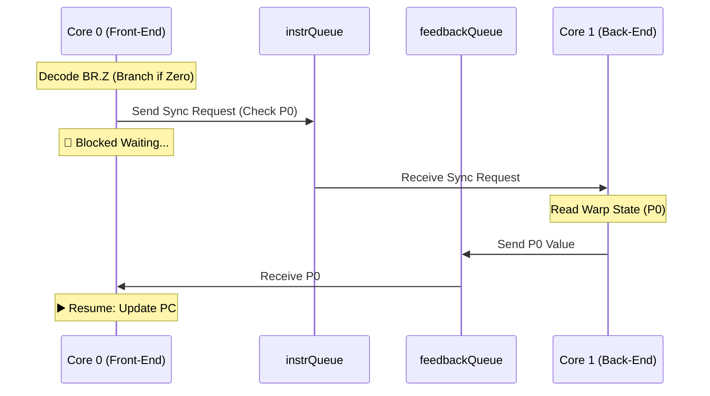

# ESP32 CUDA VM - 雙核心通訊架構指南

本文件詳細說明 Micro-CUDA VM 如何利用 ESP32 的雙核心架構 (Dual-Core Architecture) 來實現高效的並行處理，以及前段 (Front-End) 與後端 (Back-End) 之間的通訊協定。

---

## 1. 系統架構概覽

系統採用 **生產者-消費者 (Producer-Consumer)** 模型，將任務拆分為兩個獨立的 FreeRTOS Task，分別運行在不同的實體核心上。

| 角色                     | 核心       | Task 名稱      | 職責                                                         |
| :----------------------- | :--------- | :------------- | :----------------------------------------------------------- |
| **Front-End (Producer)** | **Core 0** | `frontEndTask` | 指令讀取 (Fetch)、解碼 (Decode)、PC 控制、分支預測、CLI 互動 |
| **Back-End (Consumer)**  | **Core 1** | `backEndTask`  | SIMD 執行 (Execute)、記憶體存取、Trace 生成                  |

### 通訊管道 (Communication Channels)

兩者之間通過兩個 **FreeRTOS Queue** 進行非同步通訊：

1.  **`instrQueue` (指令佇列)**:

    - **方向**: Core 0 ➔ Core 1
    - **內容**: `InstrPacket` (包含解碼後的指令、PC、Cycle 等)
    - **深度**: `VM_QUEUE_SIZE` (預設 16)
    - **用途**: 傳遞要執行的指令給 SIMD 引擎。

2.  **`feedbackQueue` (回饋佇列)**:
    - **方向**: Core 1 ➔ Core 0
    - **內容**: `uint32_t` (Predicate 值或狀態碼)
    - **深度**: 1
    - **用途**: 用於同步操作，如條件分支 (`BR.Z`) 需要等待計算結果，或程式結束 (`EXIT`) 信號。

---

## 2. 通訊協定 (Protocol)

### 2.1 資料封包結構 (`InstrPacket`)

Core 0 傳遞給 Core 1 的基本單位是 `InstrPacket`：

```cpp
struct InstrPacket {
    uint32_t pc;        // Program Counter (Debug/Trace用)
    uint32_t raw_word;  // 原始指令 (Trace用)
    Instruction decoded;// 解碼後的指令物件 (Opcode, Operands)
    uint64_t cycle;     // 邏輯週期 (Cycle Count)

    // 控制旗標
    bool is_sync_req;   // 同步請求 (例如需要讀取 Predicate)
    bool is_exit;       // 程式結束信號
};
```

### 2.2 一般指令流程 (Pipeline Flow)

對於絕大多數指令 (`IADD`, `MOV`, `LDG` 等)，Core 0 只負責將指令「射後不理 (Fire-and-Forget)」放入 Queue，Core 1 此時可能正在執行前一條指令。這樣可以達到管線化 (Pipelining) 的效果，隱藏解碼與執行的延遲。



### 2.3 分支同步流程 (`OP_BRZ`)

當遇到條件分支指令 (`BR.Z`) 時，Core 0 無法決定下一條指令的 PC，必須等待 Core 1 的運算結果 (Predicate P0)。這時會觸發 **同步 (Synchronization)**：

1.  Core 0 發送帶有 `is_sync_req = true` 的封包到 `instrQueue`。
2.  Core 0 進入 **阻塞 (Blocking)** 狀態，等待 `feedbackQueue`。
3.  Core 1 收到 `sync_req`，暫停執行，讀取目前的 Predicate (P0) 狀態。
4.  Core 1 將結果寫入 `feedbackQueue`。
5.  Core 0 收到結果，更新 PC (跳轉或繼續)，恢復 Pipeline。



### 2.4 程式結束流程 (`OP_EXIT`)

當遇到 `EXIT` 指令時，需要確保 Core 1 執行完所有先前的指令並正確終止：

1.  Core 0 發送 `is_exit = true` 的封包。
2.  Core 0 等待 `feedbackQueue` 的確認信號。
3.  Core 1 執行完所有指令後，處理 Exit 封包，發送 `0xFFFFFFFF` 到 `feedbackQueue`。
4.  Core 0 收到確認，重置狀態，回到 CLI 互動模式。

---

## 3. 效能考量與優化

### 通訊稅 (Communication Tax)

目前的架構已引入 **指令批次化 (Instruction Batching)**，將多條指令打包成一個 `InstrBatch` 一次傳送，大幅減少 Queue 的操作頻率 (Locking, Context Switch)。

### 記憶體一致性

由於 VRAM 是共享記憶體：

- **Data Hazard**: 由於是單向 Pipeline，Core 1 總是依序執行，指令間的依賴由順序保證。
- **Host Access**: 當使用 CLI (`dma_h2d`, `dma_d2h`) 存取 VRAM 時，應確保 VM 處於 `Halted` 狀態。

---

## 4. 程式碼導讀

相關實作位於 `esp32_cuda_vm.ino`：

- **Front-End Task**: `frontEndTask` 函數 (Line ~320)
  - 負責 `vm.fetch()`, `inst.decode()`, `xQueueSend()`。
- **Back-End Task**: `backEndTask` 函數 (Line ~65)
  - 負責 `xQueueReceive()`, `simd_engine.execute()`。
- **Queue 初始化**: `setup()` 函數 (Line ~440)
